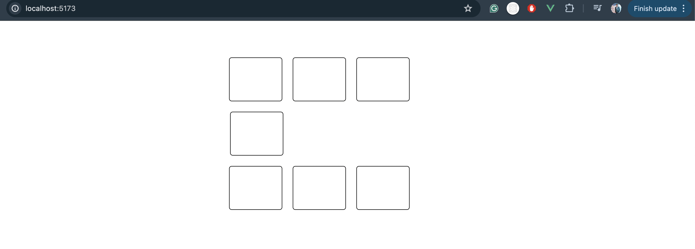
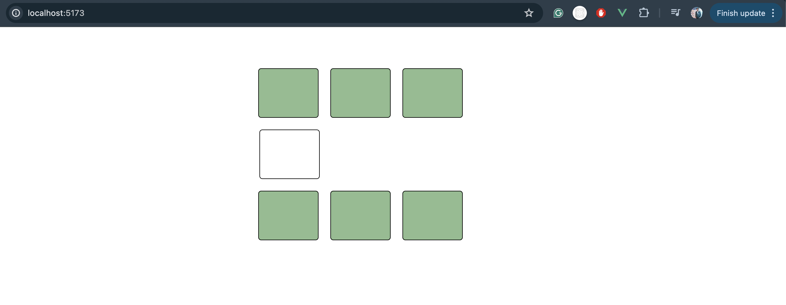

# uber-box-question - Solution in Vue.js

[Link to the question](https://devtools.tech/questions/s/how-to-create-an-interactive-shape-based-ui-uber-frontend-interview-question-or-javascript-or-react-js---qid---6FVH1ZMWMXd4uZ8WAGEi)

